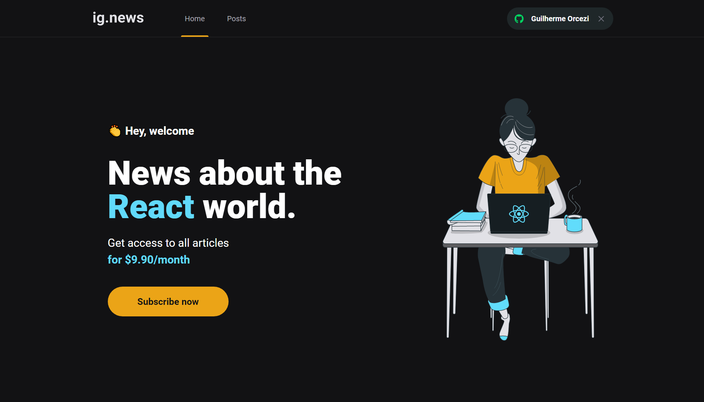

<h3 align="center">
    
    <br>
</h3>
<p align="center"> 🚀 <strong>IG News</strong> Simple blog with a month signature for reading posts.
 </p>

<p align="center">
   
  <a href="https://github.com/guilhermeorcezi/moveit#readme">
    
  </a>
  <a href="https://github.com/guilhermeorcezi/moveit/graphs/commit-activity">
    
  </a>
  <a href="https://github.com/guilhermeorcezi/moveit/blob/master/LICENSE">
    
  </a>
</p>

# :pushpin: Table of Contents

- [About](#sobre)
- [Technologies](#tecnologias-utilizadas)
- [How to run](#como-usar)
- [How to Contribute](#como-contribuir)

<a id="sobre"></a>
## :bookmark: About

The <strong>ig.news</strong> is a blog project to simulate the monthly subscription process for reading posts (dev mode).

<a id="#tecnologias-utilizadas"></a>
## :rocket: Technologies

The project was developed using the following technologies

- [TypeScript](https://www.typescriptlang.org/)
- [ReactJS](https://reactjs.org/)
- [NextJS](https://nextjs.org/)
- [Stripe](http://stripe.com/)
- [FaunaDB](https://fauna.com/)
- [Prismic](https://prismic.io/)
- [SASS](https://sass-lang.com/)

<a id="#como-usar"></a>
## :fire: How to run

To start the NextJS application:
```bash
cd web
yarn install // npm install
yarn dev // npm dev
```
You need to configure a .env.local files with fauna, stripe, github and prismic keys config:
```
# Stripe
STRIPE_API_KEY=
NEXT_PUBLIC_STRIPE_PUBLIC_KEY=
STRIPE_SUCCESS_URL= http://localhost:3000/posts
STRIPE_CANCEL_URL=http://localhost:3000/
STRIPE_WEBHOOK_SECRET=

# Github
GITHUB_CLIENT_ID=
GITHUB_CLIENT_SECRET=

# Fauna DB
FAUNADB_KEY=

# Prismic CMS
PRISMIC_ACCESS_TOKEN=
PRISMIC_ENDPOINT=
```

After the process is over, the `localhost: 3000` page containing the developed project will automatically open in your browser. 

<a id="#como-contribuir"></a>
### :recycle: How to contribute
- First, leave a ⭐ if you like it!
- Fork this repository;
- Create a branch with your feature: `git checkout -b my-feature`
- Commit your changes: `git commit -m 'feat: My new feature'`
- Push your branch: `git push origin my-feature`

## :memo: License

This project is under the MIT license. See the [licence page](https://opensource.org/licenses/MIT) for more details.

---

<h4 align="center">
    Made with 💜 by <a href="https://www.linkedin.com/in/guilherme-orcezi" target="_blank">Guilherme Orcezi</a>
</h4>
